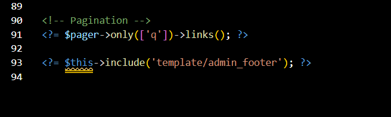

# PHP Framework (Codeigniter4)
| Praktikum 4-6  |  Pemrograman Web 2  
|-------|---------
| NIM   | 312310576
| Nama  | Taufik Hidayat
| Kelas | TI.23.A6
| Dosen |  Agung Nugroho, S.Kom., M.Kom.


## Praktikum 4
### Langkah-langkah Praktikum
- Membuat Table User
```
CREATE TABLE user (
 id INT(11) auto_increment,
 username VARCHAR(200) NOT NULL,
 useremail VARCHAR(200),
 userpassword VARCHAR(200),
 PRIMARY KEY(id)
);
```
- Membuat Model User


- Membuat Database Seeder

Database seeder digunakan untuk membuat data dummy. Untuk keperluan ujicoba modul
login, kita perlu memasukkan data user dan password kedalam database. Untuk itu buat
database seeder untuk tabel user. Buka CLI, kemudian tulis perintah berikut:


Selanjutnya, buka file UserSeeder.php yang berada di lokasi direktori
/app/Database/Seeds/UserSeeder.php kemudian isi dengan kode berikut:


Selanjutnya buka kembali CLI dan ketik perintah berikut:


- Uji Coba Login

Selanjutnya buka url http://localhost:8080/user/login seperti berikut:


- Menambahkan Auth Filter

Selanjutnya membuat filer untuk halaman admin. Buat file baru dengan nama Auth.php pada
direktori app/Filters. 


Selanjutnya buka file app/Config/Filters.php tambahkan kode berikut:
```
'auth' => App\Filters\Auth::class
```


Selanjutnya buka file app/Config/Routes.php dan sesuaikan kodenya.


Percobaan Akses Menu Admin

Buka url dengan alamat http://localhost:8080/admin/artikel ketika alamat tersebut diakses
maka, akan dimuculkan halaman login. 


## Praktikum 5
- Membuat Pagination

Pagination adalah teknik yang digunakan untuk membatasi jumlah besar data yang ditampilkan pada sebuah situs web menjadi beberapa halaman, tergantung pada jumlah data yang akan ditampilkan pada setiap halaman.

Untuk membuat pagination, buka Kembali App/Controller/Artikel, kemudian modifikasi kode
pada method public function admin_index seperti berikut.


Dan pada link pager ubah seperti berikut.
App/Views/artikel/admin_index.php bagian paling bawah diatas footer


Hasilnya akan seperti ini:


### Praktikum 6
- Menambahkan fungsi unggah gambar pada tambah artikel.

Buka kembali Controller Artikel pada project sebelumnya, sesuaikan kode pada method
add seperti berikut:


Kemudian pada file views/artikel/form_add.php tambahkan field input file seperti
berikut:


Ujicoba file upload dengan mengakses menu tambah artikel.


## Selesai & Terimakasih
